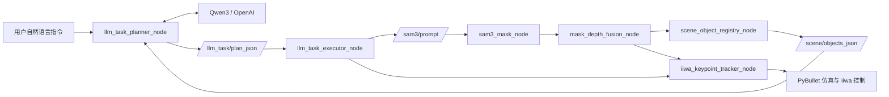

# 一页架构图讲稿

这页材料的目标是：你站在投影前，只用一张图，就能把系统讲明白。

适用版本：

- branch: `release/v0.1.4`
- tag: `v0.1.4`

## 1. 一页图

## 2. 你指着图应该怎么讲

建议从左到右，只讲 6 句话。

### 第一句：先讲入口

“系统的入口是用户自然语言指令，比如‘依次移动到红色方块、蓝色方块和黄色方块上方’。”

### 第二句：讲 planner

“指令先进入 `llm_task_planner_node`，它不会直接输出控制量，而是调用 `Qwen3` 或 OpenAI，把任务翻译成结构化 `plan_json`。”

### 第三句：讲场景摘要

“planner 不是只看文本，它还会读取 `/scene/objects_json`，也就是当前场景里有哪些物体、哪些可见、它们大致在哪。”

### 第四句：讲 executor

“`llm_task_executor_node` 会按 plan 逐步执行，每一步先切换当前语义目标，再等待感知模块确认目标锁定，然后才真正放开 tracking。”

### 第五句：讲感知

“感知链路是 `sam3_mask_node -> mask_depth_fusion_node -> scene_object_registry_node`。它的作用是把语义提示变成 3D 目标，再整理成 planner 和 executor 都能用的中间状态。”

### 第六句：讲控制闭环

“最后 `iiwa_keypoint_tracker_node` 和底层控制器把目标转成机械臂在 PyBullet 里的运动，所以这是一条从语言到执行的闭环链路。”

## 3. 每个模块一句话定义

- `Qwen3 / OpenAI`
  - 高层语义推理后端，负责“把任务变成计划”
- `llm_task_planner_node`
  - 机器人系统的 planner 适配层，负责组织 prompt、请求模型、发布 `plan_json`
- `llm_task_executor_node`
  - 计划执行状态机，负责“按步骤推进”
- `sam3_mask_node`
  - 根据语义 prompt 产生目标分割掩码
- `mask_depth_fusion_node`
  - 把 mask 和深度融合成稳定的 3D keypoint
- `scene_object_registry_node`
  - 把感知结果压缩成 planner 可理解的场景对象表
- `iiwa_keypoint_tracker_node`
  - 把 3D 目标变成机械臂关节目标
- `PyBullet`
  - 仿真环境和执行载体

## 4. 这一页最关键的讲解重点

一定要明确这三件事：

### 重点 1：这不是端到端 policy

它不是“图像 -> 动作”一个模型全包。  
它是一个分层系统。

### 重点 2：Qwen3 在这里是规划器，不是整个机器人

Qwen3 负责“理解任务并输出结构化计划”，不是直接看图输出关节角。

### 重点 3：`scene_object_registry_node` 是这次版本升级的关键中间层

它把原本分散的感知结果，变成 planner 可以消费的统一世界状态。  
没有这层，语言规划和感知执行之间会很难稳定衔接。

## 5. 最后用一句话收束

建议结尾直接说：

“这张图展示的不是一个大模型 demo，而是一条由语言理解、场景建模、计划执行和机器人控制拼接起来的分层式 VLA pipeline。”
